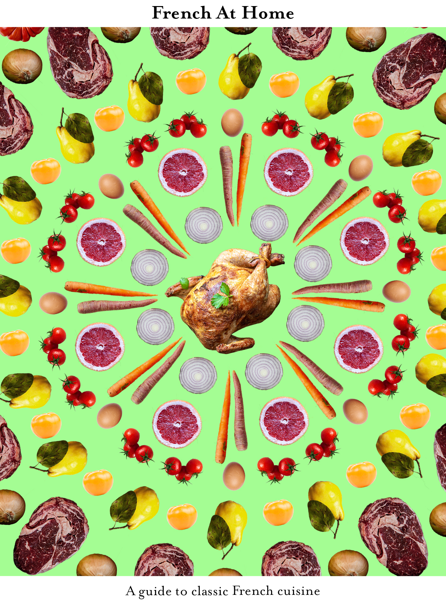

I don't often find myself drawn to cooking books when I'm online or in a book store, however when I do, I am occasionally in awe of the creative, contemporary and modernist designs those books use. I particularly enjoy the simplistic and often colourful design approaches used in Yotam Ottolenghi's book's *Simple,* *Flavour* and *Plenty More*, using iconography in the most effective way adhering to the titles of the books themselves.

 When designing the cover to french at home my key purpose was to evoke the 60s esc nostalgia carried with the "continental cuisine" craze, that was ultimately kickstarted by Chef's such as Julia Child and her iconic French cooking book. However, I also desired to appease modern audiences with a design that would stand out amongst competitors within the market, as well as be visually current. 

There is a fine line between using nostalgia effectively within marketing or design, and coming across outdated and repetitive, some cookbook covers fail to do this, while others thrive. I started the design process by drawing out a few concepts, looking to fine tune the contents on the cover, positions of typeface etc. After doing so and referring back to my key design inspirations, I came up with a symmetric concept that would use a collage of ingredients associated with the core recipe's across the page, with the title and heading originally positioned to the right. After initial feedback, it appeared that the title and heading would be more suited to to the top and bottom of the cover, to work in tandem with the symmetrical design.

