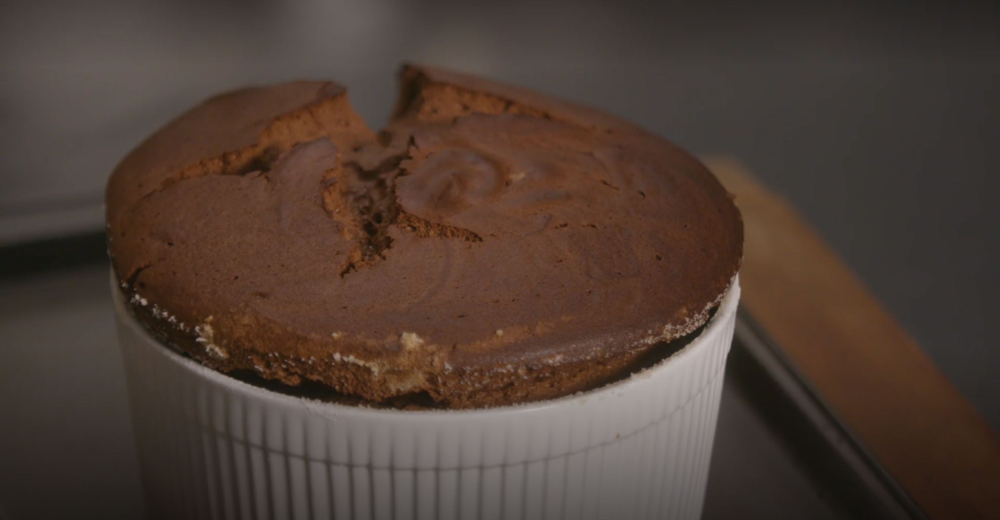

Dark and intense in flavour, yet with a light and custardy texture, a chocolate soufflé is an eternal showstopper of a dessert. To get that intense chocolate flavour, this version uses a base of melted butter and chocolate without any starch. Be sure to use excellent bittersweet chocolate, but if you prefer a slightly sweeter soufflé, feel free to substitute milk chocolate for all or part of the bittersweet. Or to move the soufflé in the other direction, substitute a chocolate with a higher cocoa solids ratio, 70 to 75 percent, which will decrease the overall sugar. For maximum "wow" factor, always serve a soufflé straight from the oven. Crème anglaise or chocolate sauce would be fine accompaniments, as would scoops of your favourite ice cream.

# Ingredients

* ½ cup/114 grams unsalted butter (1 stick), softened, plus more for coating dish
* 4 tablespoons/50 grams granulated sugar, plus more for coating dish
* 8 ounces/225 grams bittersweet chocolate (60 to 65 percent cacao), finely chopped
* 6 eggs, separated, at room temperature
*  Pinch fine sea salt
* ½ teaspoon cream of tartar

# Preparation

1. Remove wire racks from the oven and place a baking sheet directly on the oven floor. Heat oven to 400 degrees. Generously butter a 1 1/2-quart soufflé dish. Coat bottom and sides thoroughly with sugar, tapping out excess. For the best rise, make sure there is sugar covering all the butter on the sides of the dish.
2. In a medium bowl, melt chocolate and butter either in the microwave or in a bowl over a pot of simmering water. Let cool only slightly (it should still be warm), then whisk in egg yolks and salt.
3. Using an electric mixer, beat egg whites and cream of tartar at medium speed until the mixture is fluffy and holds very soft peaks. Add sugar, 1 tablespoon at a time, beating until whites hold stiff peaks and look glossy.
4. Gently whisk a quarter of the egg whites into the chocolate mixture to lighten it. Fold in remaining whites in two additions, then transfer batter to the prepared dish. Rub your thumb around the inside edge of the dish to create about a ¼-inch space between the dish and the soufflé mixture.
5. Transfer dish to baking sheet in the oven, and reduce oven temperature to 375 degrees. Bake until the soufflé is puffed and the centre moves only slightly when the dish is shaken gently, about 25 to 35 minutes. (Do not open the oven door for the first 20 minutes.) Bake it a little less for a runner soufflé and a little more for a firmer soufflé. Serve immediately.