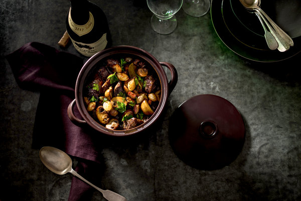

Like coq au vin, its sister dish from the Burgundy region of France, beef Bourguignon is a stew of meat slowly simmered in hearty red wine along with pearl onions, mushrooms and crisp, cubed bacon. Use a good wine here, something simple but drinkable. It makes all the difference in the finished dish. As with all beef stews, this one is best made a day or two ahead; don’t sauté the mushrooms and onions until just before serving.

# Ingredients

* 3 pounds beef chuck or other boneless stewing beef, cut into 2-inch cubes and patted dry
* 2 ¼ teaspoons kosher salt, more to taste
* ½ teaspoon freshly ground black pepper
* 5 ounces lardons, pancetta or bacon, diced (about 1 1/4 cups)
* 1 onion, finely chopped
* 1 large carrot, sliced
* 2 garlic cloves, minced
* 1 teaspoon tomato paste
* 2 tablespoons all-purpose flour
* 1 750-milliliter bottle of red wine
* 1 large bay leaf
* 1 large sprig of thyme
* 8 ounces pearl onions, peeled (about 12 to 15 onions)
* 8 ounces cremini mushrooms, halved if large (about 4 cups)
* 1 tablespoon extra-virgin olive oil
*  Pinch sugar
*  Chopped flat-leaf parsley, for garnish

# Preparation

1. Season beef with 2 teaspoons salt and 1/2 teaspoon pepper. Set aside for at least 30 minutes at room temperature, or chill in the refrigerator for up to 24 hours.
2. In a large Dutch oven or heavy-bottomed pot with a tight-fitting lid, cook lardons over medium-low heat until fat is rendered and lardons are browned and crisp, about 10 to 15 minutes. Transfer with a slotted spoon to a paper towel-lined plate. Reserve fat in the pot.
3. Heat oven to 350 degrees. Raise heat under the pot to medium-high and cook until fat is starting to smoke. Lay half the beef cubes in a single layer in the pot, leaving space between pieces. Cook until well browned on all sides, 10 to 15 minutes; transfer pieces to a plate as they brown. Repeat with remaining beef.
4. Reduce heat, if necessary, to prevent burning. Stir in onion, carrot and remaining 1/4 teaspoon salt and cook until soft, about 10 minutes, stirring occasionally.
5. Stir in garlic and tomato paste, and cook for 1 minute. Stir in flour, cook for 1 minute, then add wine, bay leaf and thyme, scraping up brown bits at the bottom of the pot. Add browned beef and half the cooked lardons back to pot, cover, and transfer to the oven. Let cook until beef is very tender, about 1 1/2 hours, turning meat halfway through.
6. Meanwhile, in a large skillet set over high heat, combine pearl onions, mushrooms, 1/4 cup water, the olive oil and a pinch each of salt, pepper and sugar. Bring to a simmer, then cover and reduce heat to medium, cooking for 15 minutes. Uncover, raise heat to high, and cook, tossing frequently, until vegetables are well browned, 5 to 7 minutes.
7. To serve, scatter onions and mushrooms and remaining cooked lardons over stew, then top with parsley.