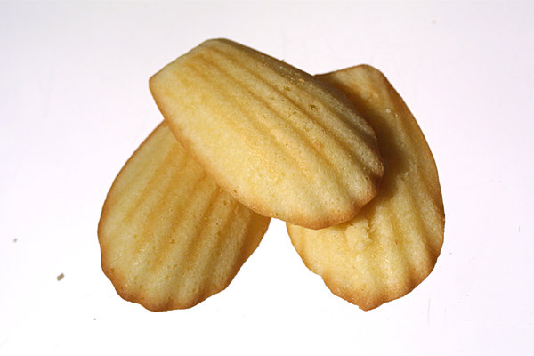

The madeleine or petite madeleine is a traditional small cake from Commercy and Liverdun, two communes of the Lorraine region in northeastern France. Madeleines are very small sponge cakes with a distinctive shell-like shape acquired from being baked in pans with shell-shaped depressions.

# Ingredients

* 4 ½ ounces sugar
* 3 ¾ ounces all-purpose flour, sifted
* ½ teaspoon baking powder
*  Pinch of salt
*  Zest of 1 orange
* 2 large eggs, at room temperature
* 3 ¼ ounces unsalted butter, melted and cooled slightly
*  Butter and flour for moulds

# Preparation

1. Combine the sugar, flour, baking powder and salt in a medium mixing bowl, stirring with a wooden spoon to blend. Add the zest. Stir in the eggs, mixing just to combine. You do not want to incorporate too much air into the batter. Finally, stir in the butter.
2. Cover the bowl with plastic film and refrigerate for 1 hour, or until well chilled. The chilling is important, as it makes the batter easier to pipe and ensures a higher rise during baking. At this point, the batter may be stored, covered and refrigerated, for up to 4 days.
3. Butter and flour the madeleine moulds.
4. Preheat the oven to 400 degrees.
5. Immediately transfer the batter to a pastry bag fitting with a #5 plain tip and pipe into the prepared moulds. Bake the madeleines for about 7 minutes (about 11 minutes for larger cakes), or until the cakes spring back in the centre when lightly touched.