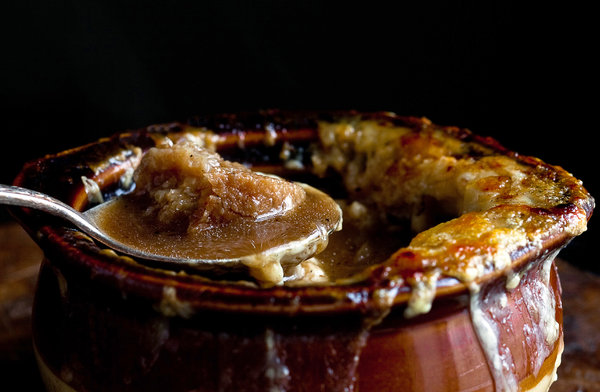

“I don’t make onion soup at home partly because I lack the flameproof bowls that chefs run under the broiler to melt the cheese. And what’s the point of making onion soup without the elastic cap of gooey Gruyère? The more I pondered this, the more I wondered if I could skip those individual bowls, layer the croutons and cheese directly into the soup pot, and just broil the whole thing.” - Melissa Clark

# Ingredients

* ¼ cup extra-virgin olive oil
* 4 pounds oxtail or beef shoulder, cut into 1- or 2-inch pieces
*  Salt
* 8 medium onions
* 4 celery stalks, coarsely chopped
* 4 medium carrots, peeled and coarsely chopped
* 2 bay leaves
* 4 thyme sprigs
* 8 tablespoons (1 stick) unsalted butter
*  Black pepper
* 1 cup port wine
*  Lemon juice, to taste, optional
* 6 ounces baguette loaf, cut into 1/2-inch-thick slices
* 2 garlic cloves, halved
* 8 ounces Gruyère cheese

# Preparation

1. Heat the oil in a 6-quart Dutch oven over high heat. Add the oxtail (or beef shoulder) in a single layer (work in batches, if necessary to avoid crowding the pan), and sear until the undersides are brown (do not turn). Season generously with salt and transfer to a plate.
2. Coarsely chop two of the onions; add to the pot, along with the celery, carrots, bay leaves and thyme. Lower heat to medium and cook, stirring occasionally, until vegetables are soft and beginning to caramelise, about 10 minutes. Return the beef to the pot. Pour in 8 cups of water. Simmer mixture gently until the meat is very tender, 2 1/2 to 3 hours.
3. Transfer beef to a bowl and let cool for another use. Strain liquid into a bowl over a fine-mesh sieve; press gently on the solids with the back of a spatula to extract as much flavour as possible. Discard the solids; you should have about 10 cups broth (add water if necessary to equal 10 cups).
4. Halve the remaining 6 onions through the root end, then peel and thinly slice them lengthwise. Melt the butter in the bottom of the Dutch oven over medium heat. Add the onions and cook, tossing occasionally, until deep golden-brown and caramelised, 45 minutes to 1 hour. Season with 1 teaspoon salt and black pepper. Pour in the port and cook, scraping up any browned bits from the bottom of the pan, for 3 minutes. Pour in the broth and simmer mixture over low heat for 30 minutes. Season with salt and lemon juice, if desired. (For a smaller group, you could refrigerate some of the soup and reheat it later.)
5. While the broth simmers, heat the oven to 350 degrees. Arrange the bread slices on a baking sheet and toast until golden, about 12 minutes. Rub the garlic halves over the surface of the bread.
6. Heat the broiler and arrange a rack 4 to 6 inches from the flame. Using a cheese slicer, thinly slice 3 ounces of Gruyère. Coarsely grate the remaining cheese. Float the broiled bread over the surface of the hot soup. Layer the cheese slices over the bread; scatter the grated cheese over it. Transfer the Dutch oven to the oven and broil until the cheese is golden and bubbling, 3 to 5 minutes (watch to see that it does not burn).
7. To serve, use kitchen shears or scissors to cut the bread and cheese into portions. Ladle soup, bread and cheese into individual bowls.

### TIP

*To broil the soup in individual bowls, place 8 ovenproof bowls on a baking sheet. Fill with hot soup, top with broiled bread, shaved cheese and grated cheese, and run under the broiler until golden and bubbling. You may need to prepare it in batches.*