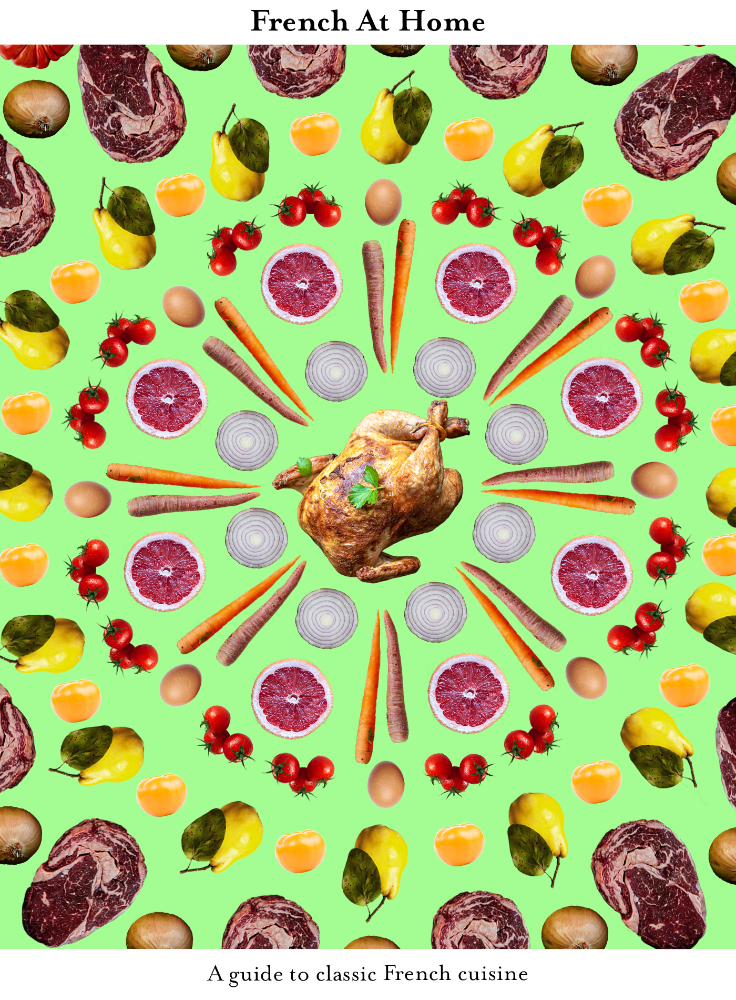

Inspired by the nostalgic and classical recipes of French cuisine, as well as the pioneers of the art of french cooking, French At Home gives the average home cook the chance to elevate the Saturday night meal for two to heights Julia Child would be fond of. 

With french savoury staples such as Beef Bourguignon and comforting confectionery in the form of Madeleines, this short guide to perfecting French cooking will open up  your palate to a whole new world of flavours and textures. Impress your friends with a delightful dish of Ratatouille, impress your sweetheart with a rich and decadent serving of chocolate souffle, wow your next dinner party with a simple though complex onion soup and cook the perfect Sunday meal Le Cordon Bleu would approve in the form of Coq au Vin

This collection of recipes is perfect for anyone devoted to the elegant art of cooking, and food, staples within the art itself.

[/recipes/](/recipes/)